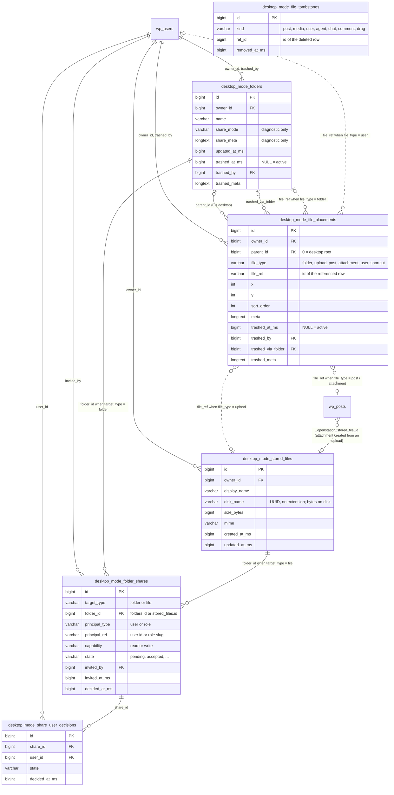
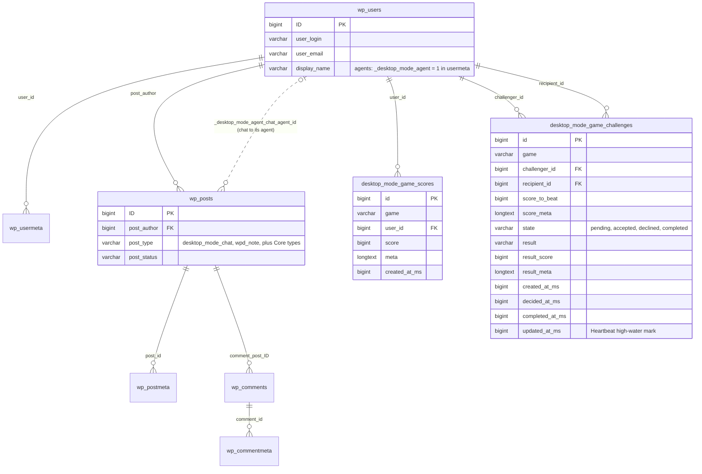

# Data model — where OpenStation keeps its data

Everything the plugin persists, and how the pieces relate: eight
plugin-owned tables, two custom post types, and a set of keys in
WordPress's own meta and options tables — plus the caches, the upload
directories and the cron hooks around them. Read this before adding a
store, renaming a key, or asking "where does X live?".

The inventory is taken from the code under `includes/` and `apps/`, not
from memory. When the code and this page disagree, the code wins and this
page has a bug.

## Which store for which data

| Data | Store | Why there |
|---|---|---|
| Desktop tiles, folders, uploaded files, shares, game scores and challenges | Plugin-owned tables (`{$wpdb->prefix}desktop_mode_*`) | Relational, high-cardinality, queried by owner / parent / state. Serialised blobs in options or meta would not index. |
| Agent conversations, sticky notes | Custom post types in `wp_posts` | They are content: they get trash, capabilities, revisions and REST for free. |
| AI agents | Rows in `wp_users` | Authorship and capabilities come from Core; the profile lives in user meta. |
| Per-user preferences, session, opt-in, play time | `wp_usermeta` | Follows the user; `get_user_meta()` is cached per request. |
| Site-wide flags, schema versions, uploaded themes | `wp_options` | One value per site; the hot ones are `autoload = no`. |
| Computed caches (content graph, Woo aggregates, feeds) | Transients | Regenerable; never a source of truth. |
| Uploaded file bytes, theme ZIP contents | Disk under `uploads/` | The database holds names and hierarchy; the disk is a dumb blob store. |

Every stored name that still reads `desktop_mode_*` / `desktop-mode-*` is
the pre-rebrand spelling and is **frozen**: those are tables, options and
meta keys holding rows on live installs. Renaming a constant does not
migrate anything — it points the code at an empty place. A real rename goes
through `includes/migrations.php`. See [AGENTS.md](../AGENTS.md) for the
full list of frozen values.

## Entity–relationship diagrams

Neither diagram shows a MySQL `FOREIGN KEY`, because there are none —
WordPress Core declares none either. Integrity is kept in code: the Files
cascade-cleanup hooks, the tombstones table, and the daily prune cron.

### Files and sharing

Six tables. `file_placements` is the desktop itself: one row per tile, with
its position and a polymorphic reference (`file_type` + `file_ref`) to
whatever the tile stands for. Dotted lines are those polymorphic references;
solid lines are plain id columns.

`file_tombstones` has no edges on purpose: it records ids of rows deleted
*outside* the plugin (a post, an attachment, a user, an agent, a chat, a
comment) so clients can drop the tiles that pointed at them.

### Core tables, agents and games

The two custom post types, the agent rows in `wp_users`, and the two Games
tables.

## Modules and the stores they write

A module per row, a store per column. Read down a column to answer "who
writes to options?"; read along a row to see everything a module touches.
The sections below name the exact tables and keys.

| Module | Own tables | `wp_users` + usermeta | `wp_posts` + postmeta | `wp_commentmeta` | `wp_options` | Transients | Disk |
|---|:-:|:-:|:-:|:-:|:-:|:-:|:-:|
| Files | ● | ● | ● | | ● | | ● |
| Folder sharing | ● | | | | | | |
| Games | ● | ● | | | ● | | |
| Agents | | ● | ● | | ● | | ● |
| Notes | | ● | ● | | ● | | |
| Recycle Bin | | | ● | ● | ● | | |
| Presence | | | | | ● | | |
| Preferences and session | | ● | | | ● | | |
| App Framework `Store` | | ● | | | ● | | |
| Desktop themes | | | | | ● | | ● |
| Media Library | | | ● | | ● | | |
| AI Copilot | | | | ● | ● | | |
| OAuth relay | | | | | | ● | |
| PWA | | ● | | | | ● | |
| Content changes feed | | | | | ● | | |
| Caches: content graph, Woo, feeds, stats | | | | | ● | ● | |
| Migrations | | | | | ● | | |

## Plugin-owned tables

Six belong to Files (desktop tiles and sharing) and two to Games. All are
created on activation and, if missing, lazily on `init`, `admin_init` and
`rest_api_init` whenever the schema-version option does not match the
constant (`includes/desktop-files/schema.php`, `includes/games/schema.php`).
Timestamps are epoch milliseconds in `BIGINT` columns, not `DATETIME`.

| Table | Module | What it holds | Created by |
|---|---|---|---|
| `desktop_mode_stored_files` | Files | One uploaded file per row. The bytes live at `uploads/desktop-mode-files/{owner_id}/{disk_name}`; the table is the only source of name, size and MIME. | `dbDelta` |
| `desktop_mode_folders` | Files | Desktop folders. `share_mode` and `share_meta` are diagnostic leftovers; visibility is computed from `folder_shares`. | `dbDelta` |
| `desktop_mode_file_placements` | Files | One row per desktop tile: position (`x`, `y`, `sort_order`), parent folder (`0` = desktop root) and what the tile stands for. `file_type` + `file_ref` is polymorphic: `folder`, `upload`, `post`, `attachment`, `user`, `shortcut`. The `trashed_*` columns carry the Recycle Bin. | `dbDelta` |
| `desktop_mode_file_tombstones` | Files | Ids of rows deleted outside the plugin (posts, media, users, agents, chats, comments) so clients drop orphaned tiles. | `dbDelta` |
| `desktop_mode_folder_shares` | Folder sharing | Access grants. `target_type` decides whether `folder_id` names a folder or a stored file; `principal_type` + `principal_ref` is a user id or a role slug. | `CREATE TABLE IF NOT EXISTS` |
| `desktop_mode_share_user_decisions` | Folder sharing | Each user's accept / decline of a grant (unique per share + user). | `CREATE TABLE IF NOT EXISTS` |
| `desktop_mode_game_scores` | Games | One row per finished play: game, user, score, free-form meta. | `dbDelta` |
| `desktop_mode_game_challenges` | Games | A challenge between two users with its state machine and result. | `dbDelta` |

The two sharing tables deliberately bypass `dbDelta`: its `DESCRIBE`-based
detection can miss an existing table on some MySQL / MariaDB setups and
then issue a bare `CREATE TABLE` that fails. Their `ensure_*` helpers check
`INFORMATION_SCHEMA` and use `CREATE TABLE IF NOT EXISTS`; the schema file
explains the history. Multisite gets one set of tables per site through
`$wpdb->prefix`.

## Custom post types (`wp_posts`)

| `post_type` | Module | What it is | Meta on the post |
|---|---|---|---|
| `desktop_mode_chat` | Agents | One conversation with an AI agent. The post belongs to the human; the agent is in meta. | `_desktop_mode_agent_chat_agent_id` → `wp_users.ID` of the agent |
| `wpd_note` | Notes | One sticky note on the desktop. | `_wpd_note_x`, `_wpd_note_y`, `_wpd_note_z`, `_wpd_note_color`, `_wpd_note_seed`, `_wpd_note_converted_post` → `wp_posts.ID` |

## User meta (`wp_usermeta`)

Keys with a leading underscore are private (hidden from REST and the
profile screen). AI agents are ordinary `wp_users` rows flagged with
`_desktop_mode_agent`, so their whole profile lives here too.

| `meta_key` | Module | Content |
|---|---|---|
| `desktop_mode_mode` | Core | The user's opt-in: `1` turns the shell on. |
| `desktop_mode_os_settings` | Preferences | Every OpenStation Preferences value (appearance, windows, navigation, features). REST-synced through `/wp-json/desktop-mode/v1/os-settings`. |
| `desktop_mode_session` | Session | Open windows and their geometry for restore. On multisite the key is suffixed: `_{blog_id}` on a secondary site, `_network` in the network admin. |
| `desktop_mode_default_window` | Core | The window that opens on arrival. |
| `desktop_mode_file_associations` | Files | Which app opens each file type. |
| `desktop_mode_pwa_state` | PWA | Install / prompt state. |
| `desktop_mode_seen_intros` | Onboarding | Intros already shown. |
| `desktop_mode_rebrand_notice` | Onboarding | Rebrand notice dismissed. |
| `desktop_mode_game_playtime` | Games | Lifetime play time per game. |
| `desktop_mode_game_playtime_days` | Games | Play time per day (rolling window). |
| `openstation_station_home_card_preferences` | Station Home | Which home cards are shown or hidden. |
| `openstation_app_store` | App Framework | The `Store` contract with `user` scope, a key → value map. Plugins stores `desktop-mode-plugins:installed-view` here (`cards` or `table`, default `cards`). The same name with `site` scope is an option. |
| `_desktop_mode_last_login_at` | Users | Last login time. |
| `_desktop_mode_has_notes` | Notes | Cache `{rev}:{0|1}` of whether the user has notes; `rev` comes from the `desktop_mode_notes_rev` option. |
| `_desktop_mode_agent` | Agents | `1` marks this `wp_users` row as an AI agent rather than a person. |
| `_desktop_mode_agent_abilities`, `_desktop_mode_agent_created_by` (→ `wp_users.ID`), `_desktop_mode_agent_description`, `_desktop_mode_agent_face`, `_desktop_mode_agent_face_seed`, `_desktop_mode_agent_instructions`, `_desktop_mode_agent_model`, `_desktop_mode_agent_rate_limit`, `_desktop_mode_agent_runs`, `_desktop_mode_agent_triggers`, `_desktop_mode_agent_vibes` | Agents | The agent's profile and run log, on its own user row. `includes/agents/store.php` owns every key. |

## Post meta and comment meta

| `meta_key` | On | Content |
|---|---|---|
| `_desktop_mode_trash_user_id` | posts, comments | Who sent the row to the Recycle Bin (→ `wp_users.ID`). |
| `_desktop_mode_trash_time_gmt` | posts, comments | When it was sent there. |
| `_desktop_mode_width`, `_desktop_mode_height` | attachments | Cached image dimensions for the Media Library; a one-time backfill is flagged by the `desktop_mode_media_dims_backfilled` option. |
| `_openstation_stored_file_id` | attachments | The stored file this attachment was created from (→ `desktop_mode_stored_files.id`). |
| `_openstation_stored_file_key` | attachments | Deduplication key of that stored file. |
| `_desktop_mode_ai_analysis` | comments | Result of the AI moderation pass. |

## Options (`wp_options`)

| `option_name` | Module | Content |
|---|---|---|
| `desktop_mode_files_schema_version` | Files | Installed schema version; a mismatch triggers the lazy install. |
| `desktop_mode_games_schema_version` | Games | Same, for the two Games tables. |
| `desktop_mode_migration_version` | Migrations | Last data migration applied (`includes/migrations.php`). |
| `desktop_mode_extended_options` | Preferences | Site-wide extended options: Media Library enhancement, Games, AI agents, OpenStation Network, plus `window_prewarm` and `admin_asset_cache` (both default `true`; administrator opt-outs apply on shell reload). |
| `desktop_mode_desktop_themes` | Desktop themes | Themes uploaded as ZIPs and the active selection; their files go to `uploads/desktop-mode-themes/`. |
| `desktop_mode_comments_ai_moderation` | AI Copilot | Whether comment moderation by AI is on. |
| `desktop_mode_agents_defaults_seeded` | Agents | Flag: default agents already created. |
| `desktop_mode_media_dims_backfilled` | Media | Flag: dimensions backfill done. |
| `desktop_mode_notes_rev` | Notes | Global notes revision; invalidates the per-user cache. |
| `desktop_mode_terms_cache_version` | Content graph | Cache version for terms. |
| `_desktop_mode_presence` | Presence | Snapshot of every user's presence (`autoload = no`). Heartbeat updates it with a write throttle; a daily cron prunes it. |
| `_desktop_mode_content_changes_log` | Content changes | Recent content changes for the feed, capped at 100 entries (`autoload = no`). |
| `_desktop_mode_recycle_bin_change_ts` | Recycle Bin | Timestamp of the last bin change, for the badge (`autoload = no`). |
| `openstation_app_store` | App Framework | The `Store` contract with `site` scope. |

## Transients

Caches with an expiry. They live in `wp_options` under the `_transient_`
prefix unless a persistent object cache is installed. None is a source of
truth; every one regenerates.

| Prefix | Module | Content |
|---|---|---|
| `desktop_mode_cg3_*` | Content graph | The computed content graph. |
| `desktop_mode_oauth_state_*` | Auth | State of an OAuth flow in progress. |
| `desktop_mode_woo_customer_plan`, `_customer_spend`, `_product_total`, `_product_plan`, `_coupon_plan` | WooCommerce | Customer, product and coupon aggregates read from Woo's `wc_orders`, `woocommerce_order_items` and `woocommerce_order_itemmeta`. |
| `dm_user_insights_{id}` | User edit | Computed insights for one user; cleared when the account is edited. |
| `desktop_mode_about_feed_v1`, `_failure_v1`, `_stale_v1` | About | The news feed and its failure / stale states. |
| `desktop_mode_living_tree_snapshot` | Living Tree | Wallpaper snapshot. |
| `desktop_mode_site_views_meta` | Stats | Site views metadata. |
| `openstation_shell_build` | PWA | Hash of the shell bundles, used to detect a deploy. |
| `dm_pwsz_map` | Plugins | On-disk size of each plugin. |

The Plugins app also uses the `desktop-mode-plugins` object-cache group for
in-request caching.

## Disk, cron and the browser

| Resource | Kind | Use |
|---|---|---|
| `uploads/desktop-mode-files/{owner_id}/{disk_name}` | Disk | Bytes of each stored file; `disk_name` is an extension-less UUID. |
| `uploads/desktop-mode-themes/` | Disk | Uploaded desktop themes. |
| `uploads/desktop-mode-agent-faces/` | Disk | Generated agent face images. |
| `desktop_mode_files_daily_prune` | Cron (daily) | Sweeps ZIP temp files and reconciles stored files against the disk. |
| `desktop_mode_presence_daily_prune` | Cron (daily) | Prunes the presence option. |
| `desktop-mode-widgets-geometry`, `openstation-widgets-geometry-frame`, `desktop-mode/files`, … | `localStorage` | Widget geometry and other client state; never reaches the database. |

## Related

- [Files on the Desktop](./files-on-desktop.md) — the registry and the
  placements model from the plugin author's side.
- [Folder Sharing](./folder-sharing.md) — the ACL model on top of
  `folder_shares` and `share_user_decisions`.
- [Architecture](./architecture.md#preference-persistence) — preference
  and session persistence in detail.
- [Multisite](./multisite.md) — session scoping across a network.

## Agent job storage

All names below are per-site. No transient or browser cache is the source of
truth for job execution.

| Name | Kind | Contents / lifetime |
|---|---|---|
| `openstation_agent_job_{uuid}` | Option, non-autoloaded | Owner, agent, bounded message/history, source, timestamps, status, result/error. Retained for one day. |
| `openstation_agent_job_claim_{uuid}` | Option, non-autoloaded | Atomic execution claim, retained with the job; never recycled for retries. |
| `openstation_agent_job_active_{owner}_{agent}` | Option, non-autoloaded | Admission slot (`uuid|deadline`), released on completion/failure, expiry or cleanup. |
| `openstation_agent_job_run` | Single cron event, UUID argument | Executes a queued invocation once. |
| `openstation_agent_job_cleanup` | Single cron event, UUID argument | Deletes job input/result and its claim after one day. |
